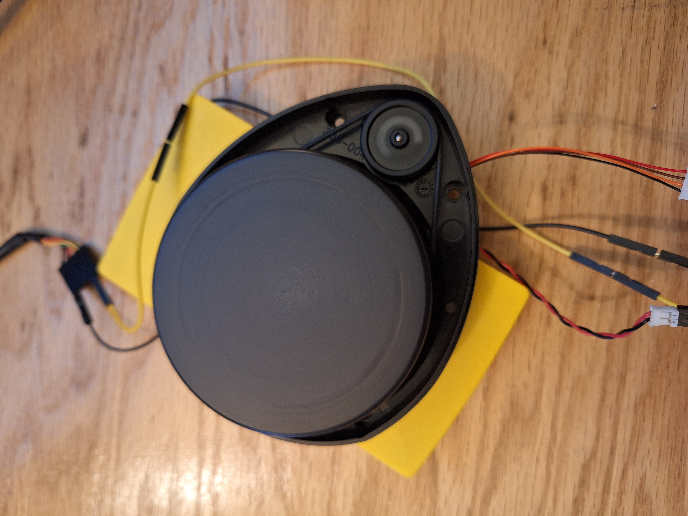
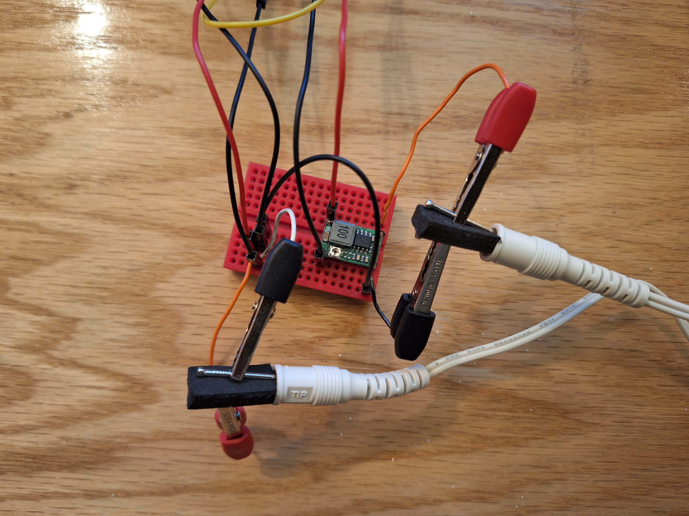
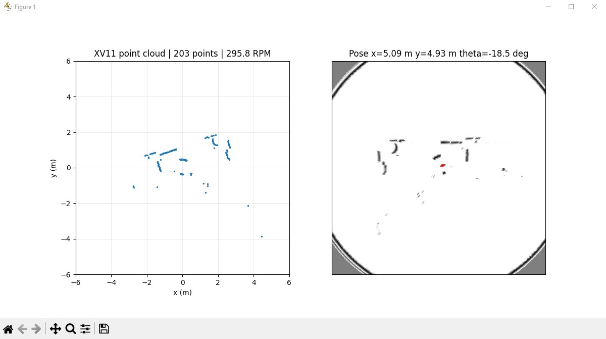

# XV11 LIDAR SLAM Viewer

Python project for a Neato XV-11 / LDS-series UART LIDAR:



```text
XV11 LIDAR -> USB Serial -> Python -> (x, y) points -> Matplotlib

LIDAR Scan -> Scan Matching -> Robot Pose Estimate -> Map Update
```

## Hardware



- Neato XV11 / LDS-series LIDAR
- USB-to-UART serial adapter
- Shared ground between the LIDAR and serial adapter
- Separate motor power so the LIDAR spins steadily while data is read over UART

## Install

Use Python 3.9-3.11 if possible. BreezySLAM can be fussy on newer Python versions.

```powershell
python -m venv .venv
.\.venv\Scripts\Activate.ps1
pip install -r requirements.txt
```

For SLAM mode, install BreezySLAM from its upstream GitHub repository:

```powershell
pip install -r requirements-slam.txt
```

If BreezySLAM fails to build on Windows, keep using `--mode pointcloud` to validate
the UART stream first. BreezySLAM includes native/C-extension code and may require
Visual Studio Build Tools or a Linux/WSL environment.

## Run

List serial ports:

```powershell
python main.py --list-ports
```

Point cloud only:

```powershell
python main.py --port COM3 --mode pointcloud
```

Point cloud plus BreezySLAM map:

```powershell
python main.py --port COM3 --mode slam
```

Example point-cloud and map visualization:



Most XV11 units stream at `115200` baud. If your adapter or firmware differs:

```powershell
python main.py --port COM3 --baud 115200
```

## Notes

- The LIDAR motor must be powered and spinning steadily. UART alone usually reads data, but does not regulate motor speed unless your hardware exposes motor control separately.
- BreezySLAM estimates relative motion from scan matching. It works best after tuning the usable distance range and with slow, smooth robot motion.
- Distance samples are in millimeters. The viewer plots point-cloud axes in meters.
